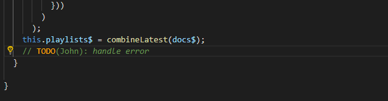
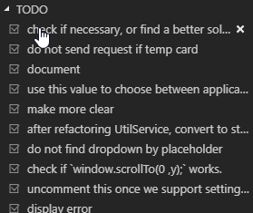
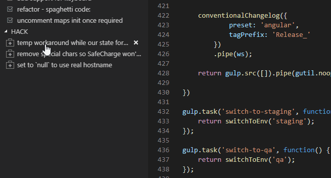

# TODO List

List all of your TODO-type comments in an easy-to-read tree view panel.
`Syntax Highlighting`, `Trello`/`Gmail`/`GitHub` `Integration` included.


https://marketplace.visualstudio.com/items?itemName=TzachOvadia.todo-list



## Table of Contents
- [Features](#Features)
- [Supported Comments](#Supported-Comments)
- [Settings](#Settings)
- [Supported Languages](#Supported-Languages)

## Features
### Convenient way to view tagged comments
  


### Remove, Copy & Edit comments easily


#### Usage
`Right-Click` a comment in `Action Comments` -> Remove/Copy/Edit

### Insert comment quickly
Press `Ctrl`/`CMD` + `Shift` + `A` to insert a comment in current cursor position.

### Comment formatting


### **Trello Integration** - Create Trello card directly from your IDE



#### Usage
- Right-Click a comment in `Action Comments` list -> `Create Trello Card`.
  > On first use, you'll have to supply a token. If you don't have a token, just press `Esc` and follow the notification instructions.
  >
  >  Next, you'll need to select a Trello list to create cards in.
- That's it. The card is created in the list you selected on first use.

### **Gmail Integration** - Send comment to mail recipient



#### Usage
- Right-Click a comment in `Action Comments` list -> `Send using Gmail`.

### **GitHub Integration** - Open GitHub issue directly from your IDE

#### Usage
- Right-Click a comment in `Action Comments` list -> `Open GitHub Issue`.
- Enter your GitHub username and password.

## Supported Comments
TODO List supports any comment written in the next formats:
```
// <ACTION>(NAME*): <message>
/* <ACTION>: <message> */
<!-- <ACTION>(NAME*): <message> -->
```

*Name is optional

Examples:
```
// TODO: Refactor everything
/* FIXME: Please please please */
// HACK(john): This is a workaround
<!-- TODO(john): A comment in HTML file -->
```

Common tags/types:
- `TODO` – something to be done.
- `FIXME` – should be corrected.
- `HACK` – a workaround.
- `BUG` – a known bug that should be corrected.
- `UNDONE` – a reversal or "roll back" of previous code.

## Settings

- **Expression**

  RegExp to use for extracting comments (first group must be type, last must be text). We recommend capturing only all-uppercase types to avoid capturing `tslint:` and commented properties.

  Default: ```(?:\/\/|\/\*|\<\!--)[ ]?([A-Z]+)(?:\:|\(([A-Za-z\/\d ]+)\)\:)[ ]?(.*?)[ ]?(?:--\>|\*\/|$)```

- **Scan On Save**

  Scan comments when saving a file.

  Default: ```true```

  **Include**

  Glob pattern to include in scans.

  Default: ```**/*.{ts,js,php,css,scss,html}```

- **Exclude**

  Glob pattern to exclude from scans.

  Default: ```{**/node_modules/**,**/bower_components/**,**/dist/**,**/build/**,**/.vscode/**,**/_output/**,**/vendor/**,**/*.min.*,**/*.map}```

- **Name**

  Name to use as `Created by`.

  Default: `empty`

  **Action Types**

  Comma-separated action types to select from when inserting a new comment.

  Default: `TODO,FIXME,HACK,BUG,UNDONE`

- **Enable Comment Formatting**

  Enable comment formatting (Set color for comment type and make text italic)

  Default: `true`

- **Trello:Token**

  In order to create Trello cards, this extension requires read and write permissions.
  
  [Click here to generate token](https://trello.com/1/authorize?name=TODO%20List&scope=read,write&expiration=never&response_type=token&key=a20752c7ff035d5001ce2938f298be64).

- **Trello:Default List**

  List ID to create cards in (will be automatically set on first use)

## Supported Languages
This extension currently supports `Javascript`, `Typescript`, `PHP`, `CSS/SCSS` and `HTML`.